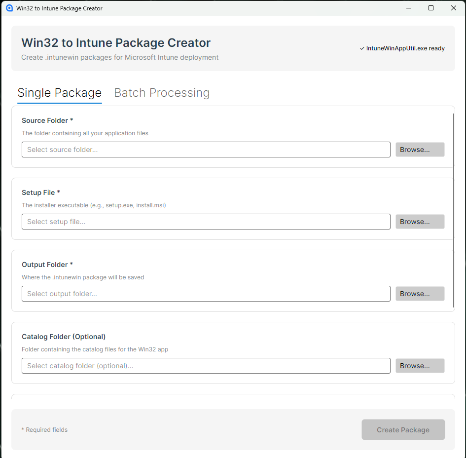
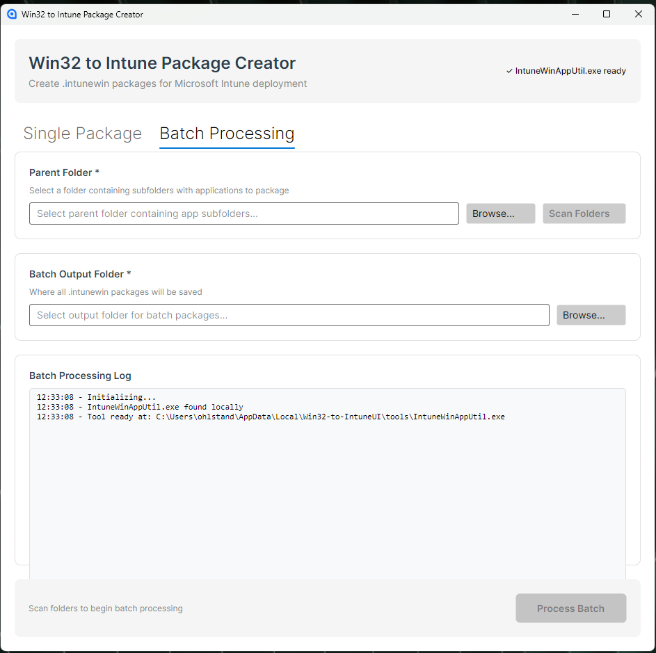

# Win32 to Intune Package Creator

An app built with Avalonia for creating `.intunewin` packages for Microsoft Intune deployment.

## Requirements

.NET 10 for the UI   
https://dotnet.microsoft.com/en-us/download   
Just download the SDK and install it. Nothing else needed.

.NET Framework >= 4.7.2 for MS Prep Tool   
https://github.com/microsoft/Microsoft-Win32-Content-Prep-Tool


## How It Works

The application automatically downloads `IntuneWinAppUtil.exe` from Microsoft's repo on first launch. The tool is stored locally and does not need to be downloaded again.

**There is two modes:**

### Single Package Mode



Create individual `.intunewin` packages one at a time:

1. Launch the application
2. Select the source folder containing your application files
3. Select the setup file (installer executable or MSI)
4. Select the output folder where the package will be saved
5. Optionally, select a catalog folder
6. Click "Create Package"

### Batch Processing Mode



Process multiple applications at once:

1. Select a parent folder containing subfolders with different applications
2. Click "Scan Folders" to detect applications
3. Select an output folder for all packages
4. Click "Process Batch" to create all packages

The application will create `.intunewin` files in the specified output folder.

## Tool Storage

The downloaded tool is stored at:  
`%LocalAppData%\Win32-to-IntuneUI\tools\IntuneWinAppUtil.exe`

## Building

```
git clone https://github.com/JohnKesko/Win32-to-IntuneUI.git
cd Win32-to-IntuneUI
dotnet run --project Win32-to-IntuneUI/Win32-to-IntuneUI.csproj
```

## Release Build

To create a self-contained executable for distribution:

```bash
dotnet publish -c Release
```

The executable will be located at:  
`Win32-to-IntuneUI/bin/Release/net10.0/win-x64/publish/Win32-to-IntuneUI.exe`

## License

This project is open source. The Microsoft Win32 Content Prep Tool is licensed separately by Microsoft. See the [official repository](https://github.com/Microsoft/Microsoft-Win32-Content-Prep-Tool) for license terms.
